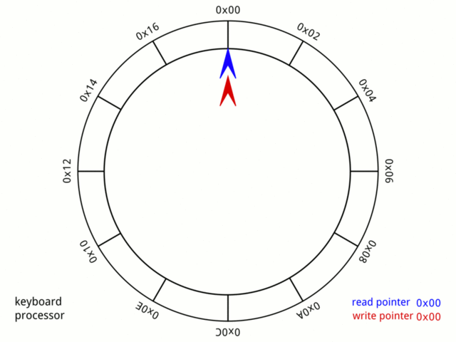
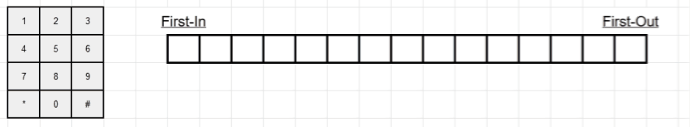

# Ring Buffer API

A simple C implementation for a ring (circular) buffer.

## About

In computer science, a circular buffer, circular queue, cyclic buffer or ring buffer is a data structure that uses a single, fixed-size buffer as if it were connected end-to-end. This structure lends itself easily to buffering data streams. You can see how it works below.






## API

````c
int BUFFER_init(RingBuffer *ringBuffer, uint16_t *buffer, int size);
````
````c
int BUFFER_insert(RingBuffer *ringBuffer, uint16_t data);
````
````c
int BUFFER_getFirst(RingBuffer *ringBuffer, uint16_t *data);
````
````c
int BUFFER_getLast(RingBuffer *ringBuffer, uint16_t *data);
````
````c
int BUFFER_getCurrentHeadIndex(RingBuffer *ringBuffer);
````
````c
int BUFFER_getCurrentTailIndex(RingBuffer *ringBuffer);
````
````c
int BUFFER_getSize(RingBuffer *ringBuffer);
````
````c
int BUFFER_getCount(RingBuffer *ringBuffer);
````
````c
int BUFFER_isFull(RingBuffer *ringBuffer);
````
````c
int BUFFER_isEmpty(RingBuffer *ringBuffer);
````
````c
void BUFFER_flush(RingBuffer *ringBuffer);
````


#### Definition of ring buffer structure

```c
typedef struct RingBuffer {
    uint16_t *buffer;
    int head;
    int tail;
    int size;
    bool full;
} RingBuffer;
```

## Author

[Khalyamin Vladimir](https://github.com/vkhalyamin) &ndash; vkhalyamin@protonmail.com

## License

This project is licensed under the MIT License &ndash; see the LICENSE file for details.

